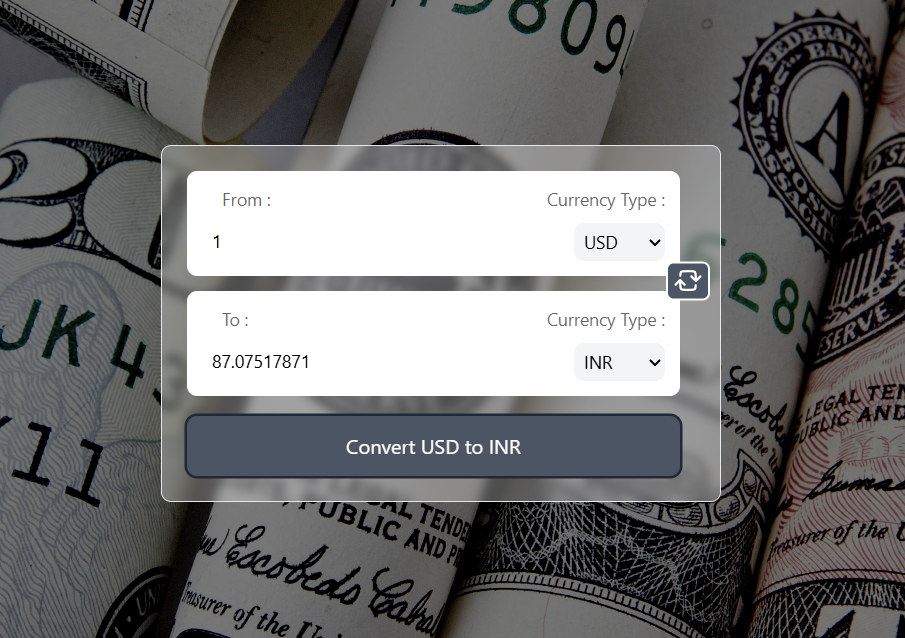

# Real-time Currency Converter

A simple currency converter built using **React.js** and **Tailwind CSS**, which fetches real-time exchange rates via an API.

---

## Features

- **Live Currency Conversion**
- **Swap Currencies**
- **Real-Time Exchange Rates**
- **Responsive UI**

---

## Screenshot



---

## Technologies Used

- **React**
- **Tailwind CSS**
- **JavaScript (ES6+)**
- **Currency API** (for fetching real-time exchange rates)

---

## API Used

- **Currency API**: [@fawazahmed0/currency-api](https://github.com/fawazahmed0/currency-api)

---

## How It Works

1. **User enters the amount** they want to convert.
2. **Selects the currency** they are converting from and to.
3. **Clicks "Convert"** to fetch the live exchange rate and get the converted amount.
4. **Swap currencies** using the swap button to quickly reverse the conversion.

---

## Installation & Setup

1. Clone the repository:
   ```bash
   git clone https://github.com/laksssshhhhya/react-concepts-projects.git
   cd react-concepts-projects
   ```
2. Install dependencies:
   ```bash
   npm install
   ```
3. Start the development server:
   ```bash
   npm start
   ```
4. Open `http://localhost:3000/` in your browser.

---
